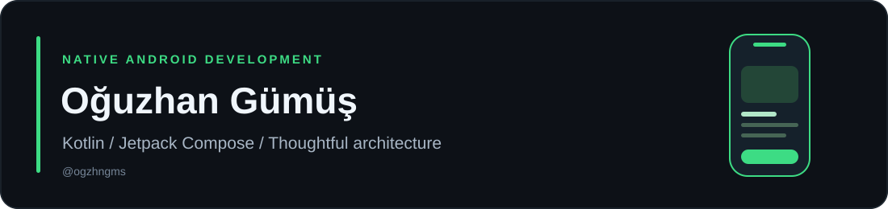

## Hi, I'm Oğuzhan

I'm a mobile QA engineer with 3+ years of manual and automated testing experience, and I build native Android apps with **Kotlin** and **Jetpack Compose**. At Wingie Enuygun Group I tested the Enuygun iOS and Android apps and migrated the test automation framework from Java + TestNG to Gauge.

**CV and projects:** [ogzhngms.github.io](https://ogzhngms.github.io)

### What I'm working with

| Testing | Android | Tools |
| --- | --- | --- |
| Appium · Selenium · Gauge | Kotlin · Jetpack Compose | Git · GitHub · Jenkins |
| TestNG · JUnit · Cucumber · REST Assured | Material 3 · ViewModel · StateFlow | JIRA · TestRail · Charles Proxy |
| BDD · TDD · Page Object Model | Firebase · Compose UI tests | Android Studio · Xcode |

### Currently building

**Sutakibi — a simple daily water tracker**

A native Android app with a daily progress ring, cup tracking, undo, local persistence, and light/dark themes. Built with Compose and a Presentation / Domain / Data structure, with unit and Compose UI tests.

In closed testing on Google Play · [join the test](https://groups.google.com/g/sutakibi-testers) · *source repository is private*

### Writing (Turkish, on Medium)

- [First app on Google Play: 12 testers, 14 days and closed testing](https://medium.com/@oguzhan.gumus.0808/google-playde-ilk-uygulama-12-test-kullan%C4%B1c%C4%B1s%C4%B1-14-g%C3%BCn-ve-kapal%C4%B1-test-cadecc5f71c2)
- [Before you ship to the Play Store: 8 checks before saying "verified"](https://medium.com/@oguzhan.gumus.0808/play-storea-s%C3%BCr%C3%BCm-g%C3%B6ndermeden-%C3%B6nce-do%C4%9Fruland%C4%B1-demeden-8-kontrol-052517db65a3)

### Earlier work

- [SnakeGame](https://github.com/ogzhngms/SnakeGame) — Java project
- [Projecttest](https://github.com/ogzhngms/Projecttest) — Java practice
- [42 Piscine](https://github.com/ogzhngms/ecole42pisicine) — C exercises

---

**My focus:** reliable mobile apps, readable code, and tests for the flows that matter.
